# ICOMS 软件使用说明

## 软件界面

---

### 主界面

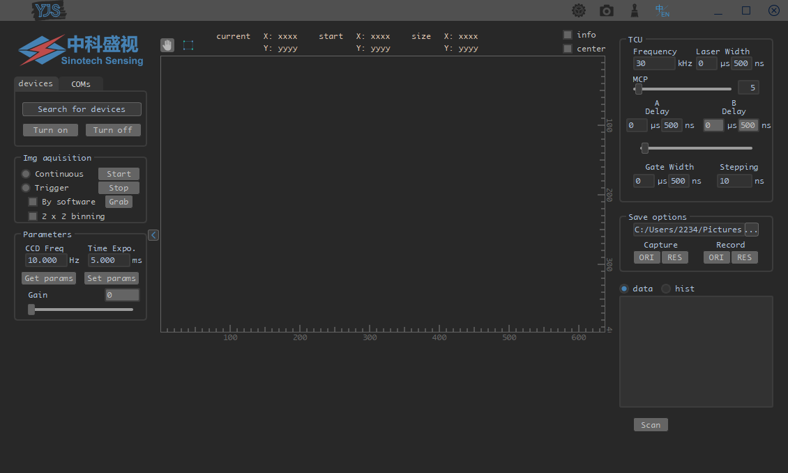

---

### 设置界面

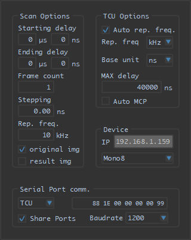

## 分组功能

---

### 主界面
#### 标题栏

1. 程序图标

1. 设置按键

	打开设置菜单 (设置菜单界面如下):

	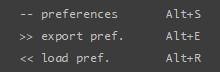

	1. preferences 设置 (快捷键 Alt + S)

		显示设置界面 (具体内容见后)

	2. export pref. 导出设置文件 (快捷键 Alt + E)

		程序将弹出对话框，引导使用者选择设置文件的保存位置及名称
      	
		具体保存内容如下:
		1. 程序设置:
			- 程序所使用的串口号
			- 图片及视频的默认保存位置
		2. TCU设置:
			- 激光重频及其脉宽
			- 选通门的延时与门宽
			- mcp及其他TCU偏好设置
		3. 扫描设置

	3. load pref. 导入已保存的设置 (快捷键 Alt + R)

        导入预先保存的设置, 并依此设置程序参数
      	
		\*注1: 此操作支持文件拖拽 (拖拽文件至程序界面中)
      	
		\*注2: 当读取设置文件失败时程序将会保持原有参数不变, 并并弹窗提示

1. 截屏按键

	单击此按键以进行程序屏幕截图, 并保存至图片储存目录 (保存的图片文件名以screenshot_起始)

1. 清理按键

	单击此按键以清除界面显示 (串口数据, 图像显示界面)

	\*注: 在非预览状态下, 清除按键会额外清除程序中的图像缓存

1. 语言切换按键

	单击此按键以切换显示界面语言

	开发中

#### 设备/串口连接

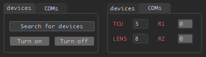

1. Search for devices 设备搜索 (目前支持海康以太网，凌图以太网/USB工业相机)

	单击此按键进行设备搜索, 当程序搜索到与电脑相连的相机时, Turn on 按键将会亮起

	\*注: 当有多台相机连接至电脑时, 将会使用第一台搜索到的相机

1. Turn on 连接至相机

	单击此按键连接至相机, 相机开启后 Turn off 按键将会亮起

	\*注: 当以太网相机连接失败时, 可先检查相机是否与电脑处于同一网段, 若他们处于不同网段, 则可调整电脑局域网设置, 或于设置界面调整相机ip

1. Turn off 断开连接

	单击此按键断开与相机的连接

	\*注: 断开连接后会程序会自动进行一次设备搜索

1. TCU, LENS, R1, R2 时序控制器, 镜头, 预留1, 预留2

	填写对应串口号并敲击回车以连接对应串口, 连接时默认波特率为9600, 其值可在设置界面中进行修改, 程序支持的波特率包括: 1200, 2400, 4800, 9600, 19200, 38400, 57600, 115200

	\*注1: 当程序启动时将会尝试连接默认串口 (分别为3, 8, 0, 0), 且镜头串口目前保留

	\*注2: 当程序成功连接特定串口后, 对应串口标识将变为淡蓝色; 若未能成功连接串口, 对应标识将变为淡红色

#### 相机采集控制

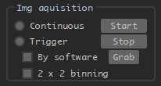

\*注: 此分组中设置仅可在相机未采集图像 (预览) 时调整

1. Continuous 连续模式 (与触发模式互斥)

	此项被选中时, 相机将使用连续模式进行图像采集

1. Trigger 触发模式 (与连续模式互斥)
   
	此项被选中时, 相机将使用触发模式进行图像采集 (相机支持软触发与外触发模式)

1. By Software 软件触发模式

	当此复选框未被选中时, 相机将只接受外部给予的(硬)触发信号 (如OPTO光耦触发), 曝光时间由高电平持续时间决定

	当此复选框被选中时, 相机将只接受接受软件给予的触发信号, 同时 Grab 按键将会亮起

1. Grab 软触发
   
	当此按键亮起时, 每单击一次此按键, 相机将进行一次图像采集 (曝光时间为其输入框中的值)

1. 2 x 2 binning (目前只支持海康相机)

	当此复选框被选中时, 相机将执行2 x 2 binning后输出图像

1. Start 开始预览

	单击此按键进行图像采集的预览, 同时 Stop 按键将会亮起

1. Stop 停止预览

	单击此按键停止图像采集的预览

#### 相机参数控制

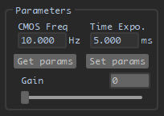

1. CMOS Freq. 相机帧频

	此项输入支持浮点数 (精度至0.001, 即10mHz), 输入后敲击回车 (或单击 set params 按键) 进行设置

1. Time Expo. 曝光时间

	此项设置单位为毫秒 (ms), 输入支持浮点数 (精度至0.001, 即1μs), 输入后敲击回车 (或单击 set params 按键) 进行设置

1. Gain 增益

	相机可调增益为 0 - 23 dB

	拖动滑块, 或在输入框中输入后敲击回车进行设置

1. Get params 获取相机参数

	单击此按键获取当前相机设置 (帧频, 曝光时间, 增益), 并显示

1. Set params 设置相机参数

	单击此按键设置相机参数 (帧频, 曝光时间)

#### 杂项显示

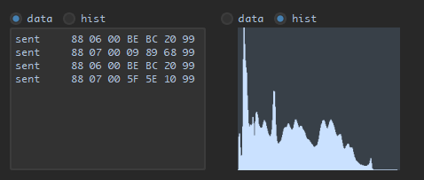

1. data 串口数据显示

	选中此项时, 下方将会显示文本框, 其中会展示向串口发送与从串口接收的数据, 分别以 sent / received 标注

1. hist 图像直方图显示

	选中此项时, 下方将会显示当前所显示图片的灰度直方图 (灰度值为0的像素不计)

	\*注: 灰度直方图为成比例显示, 其中以最高项为 1, 其他项为其真实计数与最高项计数的比例

#### TCU参数设置

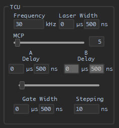

\*注1: 此分组中数据输入均以敲击回车键 (主键盘或数字键盘) 的方式进行设置, 且仅在已连接TCU串口时生效

\*注2: 对于脉宽, 门宽, 与延时设置, 如需设置超过 999ns的数值, 可在 μs 与 ns 中分别输入, 或在ns中输入完整数值  
例: 需求 2500ns 延时时, 可在 μs中输入2, ns中输入500后敲击回车, 或在 ns中输入2500后输入回车, 两种设置方式等价

1. Frequency 激光重频 (PRF)

	此项输入仅接受整型输入, 其单位可在设置界面调整 (目前支持 Hz, kHz)

1. Laser Width 激光脉宽

	此项输入仅接受整型输入, 其输入框分为 μs 与 ns 两部分

1. MCP

	此项设置与相机增益类似, 控制成像亮度

	拖动滑块, 或在输入框中输入后敲击回车进行设置

	\*注: 输入框中仅接受 0 - 255 的整型输入

1. delay 延时

	此项设置控制选通门开启的延时, 其输入仅接受整型输入, 其输入框分为 μs 与 ns 两部分

1. Gate Width 门宽

	此项设置控制选通门的开启时间, 其输入仅接受整型输入, 其输入框分为 μs 与 ns 两部分

1. Stepping 步长

	此项设置控制手动调整延时与门宽时的步长, 其中
	|         | 增加5倍步长 | 减少5倍步长 | 减少1倍步长 | 增加1倍步长 |
	| :----: | :-------------: | :-------------: | :-------------: | :------------: |
	| 延时 | 键W              | 键S               | 键A               | 键D              |
	| 门宽 | 键I                | 键K              | 键J               | 键L               |

	\*注: 步长单位可于设置界面调整 (目前支持 ns, μs)

#### 图像/视频存储设置

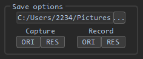

1. 存储位置

	- 可单击...按键开启文件夹对话框后进行选择 (新建或选择已有)
	- 可直接修改存储路径至电脑已有路径
	- 可直接于输入框中输入新路径 (新路径须位于已有路径下)

	\*注: 如创建文件夹失败, 程序将弹窗提示

1. Capture 抓图

	- ORI: 单击一次此按键后会开始向目标位置中写入成像原始数据, 速度与当前帧频相同, 再次单击后停止写入
	- RES: 单击一次此按键后会开始向目标位置中写入修正过的图像数据, 速度与当前帧频相同, 再次单击后停止写入

	\*注: 当内存中暂存的未写入图片过多时, 程序会自动停止图片写入并弹窗提示

1. Record 录制

	- ORI: 单击一次此按键后会开始以成像原始数据为基础进行视频录制, 并加入信息提示 (当前延时/门宽) , 再次单击后停止录制
	- RES: 单击一次此按键后会开始以修正图像为基础进行视频录制, 并加入信息提示 (当前延时/门宽) , 再次单击后停止录制

	\*注: 视频将缓存至系统临时文件夹, 待录制完成后移动至目标位置

#### 扫描

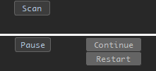

1. Scan 扫描

	在设置界面设置起止延时与帧数 (或步长) 后, 单击此按键进行扫描 (详见设置界面)

	扫描时的图片存储设置可在设置界面调整

	\*注: 单击后按键将变为暂停, 目前暂停后继续功能开发中

1. Continue/Restart 继续/重新开始 (deprecated)

	开发中

#### 显示界面

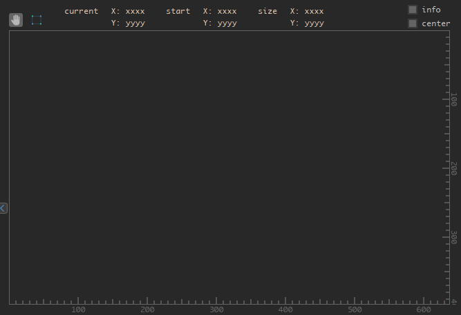

1. 图像显示区域

	图像可通过滚动鼠标滚轮的方式手动放大, 放大倍数为 1.0x, 1.5x, 2.0x, 4.0x, 8.0x

	\*注: 图像显示区域随程序界面大小变化而变化

1. 图像标尺

	在标准放大倍数下, 图像的显示尺寸大小, 随图像显示区域大小变化而变化

1. 移动/选择工具

	选择左侧手型工具时, 在放大图像后可拖拽图像进行移动; 选择有车选择工具时, 可于图像上绘制选择框 (为图像感兴趣区), 于工具右侧三栏信息中显示具体信息 (当前鼠标于图像中的位置; 选择框的起始点位置; 选择框的大小)

1. info 信息显示

	选中此复选框后, 图像显示界面依据当前功能设置显示 (延时, 门宽)

1. center 中心十字线

	选中此复选框后, 图像中心将显示中心十字线, 颜色与背景灰度相关

---

### 设置界面
#### 扫描设置

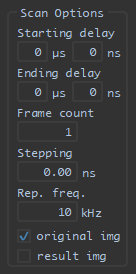

1. starting / ending delay 起止延时

	执行扫描时的起始及终止延时, 输入方式同 TCU 参数设置

1. frame count / stepping 扫描帧数 / 步长

	此二项设置互斥, 设置任意一项后另一项依据起止延时与本项自动变更, 计算方式为 $frame\_count * stepping = ending - starting\_delay$

	例: 设置起止延时分别为 0 ns 与 1 μs 后, 
	1. 设置帧数为 30, 则步长自动变更为 33.33 ns
	1. 设置步长为 10 ns, 则帧数自动变更为 100

1. Rep. freq. 扫描时重频

	执行扫描时的激光重频, 输入方式同 TCU 参数设置

1. original / result img 保存原始/修正图像

	当 original 复选框被选中时, 执行扫描将会保存每帧扫描时的原始图像

	当 result 复选框被选中时, 执行扫描将会保存每帧扫描是的修正图像

	\*注: 当有任一复选框被选中时, 程序执行扫描时将会创建扫描文件夹, 并保存本次扫描参数; 当无复选框被选中时, 程序执行扫描时将不会保存任意文件

#### 串口功能

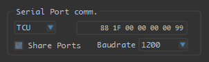

1. 串口选择

	选择串口后, 如串口已连接, 则会自动更新串口波特率设置

	默认选项为 TCU 串口

1. 波特率设置

	设置所选串口的波特率, 程序支持 1200, 2400, 4800, 9600, 19200, 38400, 57600, 115200

	\*注: 若更改串口波特率时串口未连接, 则修改无效

1. 串口数据发送

	在输入框内输入数据后, 将数据以设定的波特率发送至所选串口, 并读取数据 (超时设置 100ms)

	\*注1: 数据输入为16进制数据, 不区分大小写, 不需空格分隔, 且发送时以字节为单位发送
	\*注2: 发送数据与读取数据可在串口数据显示处查看 (主界面 6.1)
	\*注3: 若所选串口未连接, 则不会实际发送或读取数据

1. 共享串口

	若设备连接时镜头控制与TCU在串口上为同一线路, 则勾选此选项, 否则取消此项勾选

	\*注: 此选项默认勾选, 可保持此项设置不变

#### TCU选项

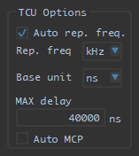

1. Auto rep. freq. 重频自动设置

	若勾选此选项, 则在主界面 TCU 设置延时时自动根据延时调整激光脉冲最小周期, 后调整激光重频 (PRF), 目前程序自动设置时激光重频最大为 30kHZ, 最小重频与延时最大值相关

	如需保持激光重频手动设置, 则取消勾选此选项

	\*注1: 此选项默认勾选
	\*注2: 手动设置重频时, 若延时与门宽之和大于激光重频对应周期, 则 TCU 可能停止工作直至调整此三项数值至正常

1. Rep. freq. 激光重频单位设置

	可于下拉菜单中选择, 目前支持 kHz 与 Hz, 选择后程序主界面与设置界面激光重频处会自动变更其单位及数值

1. Base unit 步长单位设置

	可于下拉菜单中选择, 目前支持 ns, μs, 选择后程序主界面与设置界面对应位置会自动变更其单位及数值:
	- TCU步长处
	- 图像信息显示处
	- 延时/距离最大值设置处

1. MAX delay 延时最大值设置

	设置 TCU 所支持的最大延时

	修改后 TCU 对应最大延时与最小激光重频均会变更

	\*注: 程序起始时默认值为 40000ns

1. Auto MCP MCP自适应

	当此复选框被选中时, 程序会依据当前成像亮度修改 TCU 中的 MCP 输出

	\*注1: 此项当且仅当 TCU 串口已连接时生效
	\*注2: 此项在 MCP 过低时不稳定 (低于30时)

#### 设备设置

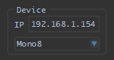

1. IP

	当使用GigE相机时, 此项会亮起, 如连接设备失败可尝试在此修改设备ip至与局域网同一网段后连接
	
	\*注: 此项当且仅当设备可达且未被连接时生效
	
1. 像素格式设置

	设备支持的像素格式为 Mono 8, Mono 10, Mono 12
