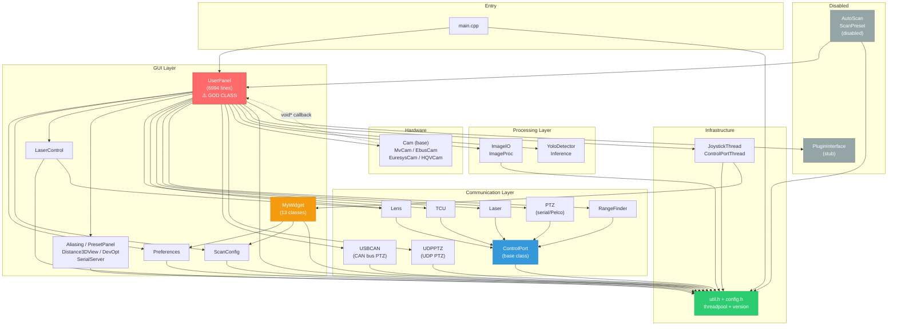
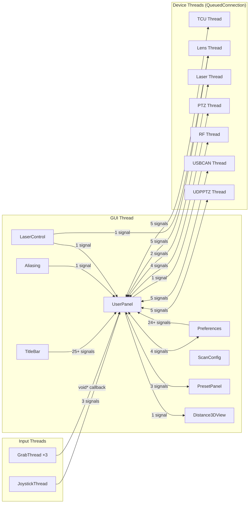

# Phase 3 — Dependency Map & Coupling Analysis

> **Project:** GLI_user_panel (v0.10.2.0)
> **Date:** 2026-02-28
> **Cross-references:** [phase1-feature-inventory.md](phase1-feature-inventory.md), [phase2-architecture-diagnosis.md](phase2-architecture-diagnosis.md)

---

## Table of Contents

1. [Module Definitions](#1-module-definitions)
2. [Compile-Time Dependency Matrix](#2-compile-time-dependency-matrix)
3. [Dependency Diagram (Mermaid)](#3-dependency-diagram-mermaid)
4. [Hotspot Analysis Table](#4-hotspot-analysis-table)
5. [Runtime Coupling — Signal-Slot Wiring](#5-runtime-coupling--signal-slot-wiring)
6. [Layering Violations](#6-layering-violations)
7. [Key Findings Summary](#7-key-findings-summary)

---

## 1. Module Definitions

For analysis purposes, the codebase is grouped into **14 logical modules** (by directory or functional cohesion):

| Module ID | Module Name | Primary Files | Layer |
|---|---|---|---|
| **MAIN** | Application Entry | `main.cpp` | Entry |
| **UP** | UserPanel (Main Window) | `visual/userpanel.h/cpp` | GUI + Controller |
| **PREF** | Preferences Dialog | `visual/preferences.h/cpp` | GUI |
| **SCAN** | Scan Config Dialog | `visual/scanconfig.h/cpp` | GUI |
| **LASER_UI** | Laser Control Dialog | `visual/lasercontrol.h/cpp` | GUI |
| **WIDGETS** | Custom Widgets | `widgets/mywidget.h/cpp` | GUI |
| **MISC_UI** | Other UI (aliasing, preset, 3dview, devopt, serialsrv) | `visual/aliasing,presetpanel,distance3dview,developeroptions,serialserver` | GUI |
| **PORT** | ControlPort Base | `port/controlport.h/cpp` | Communication |
| **DEVICES** | Device Controllers (TCU, Lens, Laser, PTZ, RF, Huanyu) | `port/tcu,lens,laser,ptz,rangefinder,huanyu` | Communication |
| **ALT_PTZ** | Alternative PTZ Controllers (USBCAN, UDPPTZ) | `port/usbcan,udpptz` | Communication |
| **CAM** | Camera Drivers | `cam/cam,mvcam,ebuscam,euresyscam,hqvcam` | Hardware |
| **IMG** | Image Processing & I/O | `image/imageio,imageproc` | Processing |
| **YOLO** | YOLO Object Detection | `yolo/yolo_detector,inference,yolo_app_config` | Processing |
| **UTIL** | Utilities & Config | `util/util,config,threadpool,version` | Infrastructure |
| **THREAD** | Threading | `thread/joystick,controlportthread` | Infrastructure |
| **AUTO** | Automation (disabled) | `automation/autoscan,scanpreset` | Automation |
| **PLUGIN** | Plugin Interface (stub) | `plugins/plugininterface` | Extension |

---

## 2. Compile-Time Dependency Matrix

Each cell shows whether the **row module** includes headers from the **column module**.

| From ↓ \ To → | UTIL | PORT | DEVICES | ALT_PTZ | CAM | IMG | YOLO | WIDGETS | PREF | SCAN | LASER_UI | MISC_UI | UP | THREAD | AUTO | PLUGIN |
|---|---|---|---|---|---|---|---|---|---|---|---|---|---|---|---|---|
| **MAIN** | ver | | | | | | | | | | | | **H** | | | |
| **UP** | cfg | | tcu,lens,laser,ptz,rf | usbcan,udpptz | mv,ebus¹,eures² | io,proc | det | | pref | scan | laser | alias,preset,3d³,sersrv | — | joy,cpt | | plugin |
| **PREF** | util | | | | | | | | — | | | | | | | |
| **SCAN** | util | | | | | | | | | — | | | | | | |
| **LASER_UI** | util | | | | | | | | | | — | | | | | |
| **WIDGETS** | util | | | | | | | **pref,scan** | | | | — | | | | |
| **MISC_UI** | util | | | | | | | | | | | — | | | | |
| **PORT** | util | — | | | | | | | | | | | | | | |
| **DEVICES** | | cp | — | | | | | | | | | | | | | |
| **ALT_PTZ** | util | | | — | | | | | | | | | | | | |
| **THREAD** | util | | | | | | | widgets | | | | | | — | | |
| **CAM** | | | | | — | | | | | | | | | | | |
| **IMG** | util | | | | | — | | | | | | | | | | |
| **YOLO** | | | | | | | — | | | | | | | | | |
| **AUTO** | cfg | | | | | | | | | | | | **UP** | | — | |
| **PLUGIN** | | | | | | | | | | | | | | | | — |

> ¹ `#ifdef WIN32` &emsp; ² `#ifdef USING_CAMERALINK` &emsp; ³ `#ifdef DISTANCE_3D_VIEW`
>
> **H** = heavy dependency (includes 20+ headers transitively)
> **cp** = controlport.h

### Key Observations

- **UP (UserPanel)** includes from **12 out of 14** other modules — it is the central dependency hub
- **UTIL** is the most depended-upon leaf module (included by 10 modules)
- **WIDGETS** has an upward dependency on **PREF** and **SCAN** (violation — widgets should not know about dialogs)
- **AUTO** depends on **UP** (automation layer depends on GUI layer — violation)
- **DEVICES** depend only on **PORT** (clean downward dependency)
- **CAM**, **YOLO**, **IMG** are relatively independent leaf modules

---

## 3. Dependency Diagram (Mermaid)



### Legend

- 🔴 Red (`UP`) — Critical hotspot: God class with fan-out of 14
- 🟠 Orange (`WIDGETS`) — Upward dependency violation
- 🟢 Green (`UTIL`) — Clean leaf module, heavily depended upon
- 🔵 Blue (`PORT`) — Clean base class hierarchy
- ⬜ Gray (`AUTO`, `PLUGIN`) — Disabled / stub code

---

## 4. Hotspot Analysis Table

| Module | Fan-in (depended upon by) | Fan-out (depends on) | Lines of Code | Risk Level | Notes |
|---|---|---|---|---|---|
| **UP (UserPanel)** | 2 (MAIN, AUTO) | **14** | 7,704 (.h+.cpp) | 🔴 **Critical** | God class — touches everything, all coupling flows through it |
| **UTIL** | **10** | 0 | 180 | 🟡 Medium | Heavily depended upon, but stable leaf module |
| **PORT (ControlPort)** | **5** (TCU,Lens,Laser,PTZ,RF) | 1 (UTIL) | 200 | 🟢 Low | Clean base class, appropriate fan-in |
| **PREF (Preferences)** | 2 (UP, WIDGETS) | 1 (UTIL) | 1,000 | 🟡 Medium | WIDGETS should not depend on this |
| **TCU** | 1 (UP) | 1 (PORT) | 550 | 🟢 Low | Clean single-parent hierarchy |
| **LENS** | 2 (UP, LASER_UI) | 1 (PORT) | 380 | 🟢 Low | Slight fan-in from laser control UI |
| **PTZ** | 1 (UP) | 1 (PORT) | 330 | 🟢 Low | Serial Pelco implementation |
| **USBCAN** | 1 (UP) | 1 (UTIL) | 270 | 🟡 Medium | Parallel PTZ — no ControlPort base, goes to UTIL directly |
| **UDPPTZ** | 1 (UP) | 1 (UTIL) | 470 | 🟡 Medium | Parallel PTZ — no ControlPort base, goes to UTIL directly |
| **CAM** | 1 (UP) | 0 | 450 | 🟢 Low | Clean leaf with abstract base |
| **IMG** | 1 (UP) | 1 (UTIL) | 1,592 | 🟢 Low | Independent processing |
| **YOLO** | 1 (UP) | 0 | 380 | 🟢 Low | Self-contained detection engine |
| **WIDGETS** | 2 (UP, THREAD) | 3 (PREF, SCAN, UTIL) | 1,054 | 🟡 Medium | Upward dependency on PREF/SCAN |
| **SCAN** | 2 (UP, WIDGETS) | 1 (UTIL) | 550 | 🟢 Low | |
| **LASER_UI** | 1 (UP) | 2 (UTIL, LENS) | 200 | 🟢 Low | Direct coupling to Lens port |
| **THREAD** | 1 (UP) | 2 (UTIL, WIDGETS) | 550 | 🟡 Medium | Thread layer depends on widget layer |
| **AUTO** | 0 | 2 (UP, UTIL) | 380 | 🟡 Medium | Depends on GUI layer — architectural violation |
| **PLUGIN** | 1 (UP) | 0 | 30 | 🟢 Low | Stub only |

### Instability Metric (Fan-out / (Fan-in + Fan-out))

Instability ranges from 0 (maximally stable, hard to change) to 1 (maximally unstable, easy to change). High-fan-out modules should be unstable (easy to change); high-fan-in modules should be stable (hard to change).

| Module | Fan-in | Fan-out | Instability | Assessment |
|---|---|---|---|---|
| **UP** | 2 | 14 | **0.88** | ⚠️ Highest instability but is the hardest to change in practice — contradiction |
| **UTIL** | 10 | 0 | **0.00** | ✅ Maximally stable, appropriate for infrastructure |
| **PORT** | 5 | 1 | **0.17** | ✅ Stable, appropriate for an abstraction |
| **WIDGETS** | 2 | 3 | **0.60** | ⚠️ Too unstable for a UI component layer |
| **AUTO** | 0 | 2 | **1.00** | ✅ Unstable is fine, but depends on wrong layer |

---

## 5. Runtime Coupling — Signal-Slot Wiring

### 5.1 Connection Count Summary

| Connection Path | Direction | # Connections | Connection Types |
|---|---|---|---|
| UP ↔ TCU | Bidirectional | 5 | QueuedConnection |
| UP ↔ Lens | Bidirectional | 5 | QueuedConnection |
| UP ↔ Laser | Bidirectional | 2 | QueuedConnection |
| UP ↔ PTZ (serial) | Bidirectional | 4 | QueuedConnection |
| UP ↔ USBCAN | Bidirectional | 5 | Mixed |
| UP ↔ UDPPTZ | Bidirectional | 5 | Mixed |
| UP ← RangeFinder | Unidirectional | 1 | Direct |
| UP ← JoystickThread | Unidirectional | 3 | Direct |
| UP ↔ Preferences | Bidirectional | 4 | Direct |
| UP ↔ PresetPanel | Bidirectional | 3 | QueuedConnection |
| UP ← Aliasing | Unidirectional | 1 | Direct |
| UP ← LaserControl | Unidirectional | 1 | Direct |
| UP → Distance3DView | Unidirectional | 1 | Direct |
| UP → UI Widgets (internal) | Internal | 15+ | Mixed |
| UP → Self (queued) | Self | 6 | QueuedConnection |
| TitleBar → UP (via signal_receiver) | Unidirectional | 25+ | Direct |
| Preferences → UP (via signals) | Unidirectional | 24+ | Direct |
| LaserControl → Lens | Direct | 1 | Direct |
| Preferences internal | Internal | 40+ | Direct/Lambda |
| ScanConfig internal | Internal | 25+ | Direct |

**Total runtime connections wired in init():** ~170+

### 5.2 Signal-Slot Coupling Diagram



### 5.3 Cross-Thread Signal Analysis

Signals crossing thread boundaries (requiring `Qt::QueuedConnection` for safety):

| Signal | From Thread | To Thread | Queued? |
|---|---|---|---|
| `send_double_tcu_msg` | GUI | TCU worker | ✅ Yes |
| `send_uint_tcu_msg` | GUI | TCU worker | ✅ Yes |
| `send_lens_msg` | GUI | Lens worker | ✅ Yes |
| `set_lens_pos` | GUI | Lens worker | ✅ Yes |
| `send_laser_msg` | GUI | Laser worker | ✅ Yes |
| `send_ptz_msg` | GUI | PTZ worker | ✅ Yes |
| `tcu_param_updated` | TCU worker | GUI | ✅ Yes (via signal) |
| `lens_param_updated` | Lens worker | GUI | ✅ Yes |
| `ptz_param_updated` | PTZ worker | GUI | ✅ Yes |
| `port_io_log` | Workers | GUI | ✅ Yes |
| `set_src_pixmap` | GrabThread | GUI | ✅ Yes |
| `set_hist_pixmap` | GrabThread | GUI | ✅ Yes |
| `update_delay_in_thread` | GrabThread | GUI | ✅ Yes |
| `update_mcp_in_thread` | GrabThread | GUI | ✅ Yes |
| `on_SCAN_BUTTON_clicked` | GrabThread | GUI | ❌ **NOT QUEUED — direct call!** |
| `pref->auto_mcp` read | GrabThread | GUI data | ❌ **No signal — direct member access** |
| `pref->ui->MODEL_LIST` | GrabThread (LVTONG) | GUI widget | ❌ **Thread-safety violation** |

**Critical thread-safety issues identified:**
1. Line 1773: `on_SCAN_BUTTON_clicked()` called directly from GrabThread — this accesses UI widgets from a non-GUI thread
2. Line 1117: `pref->auto_mcp` read from GrabThread without synchronization
3. Line 974/1841 (LVTONG): `pref->ui->MODEL_LIST->setEnabled()` called from GrabThread — direct widget manipulation from worker thread

---

## 6. Layering Violations

### 6.1 Implicit Layer Architecture

The codebase has an implicit layered architecture, but with several violations:

```
┌─────────────────────────────────────────────────────────────────┐
│                       ENTRY (main.cpp)                          │
├─────────────────────────────────────────────────────────────────┤
│                                                                 │
│   ┌──────────────────────────────────────────────────────────┐  │
│   │                  GUI LAYER                                │  │
│   │  UserPanel, Preferences, ScanConfig, LaserControl,       │  │
│   │  MyWidget, Aliasing, PresetPanel, Distance3DView         │  │
│   └──────────────┬──────────────┬────────────────────────────┘  │
│                  │              │                                │
│                  │     ┌────────┴────────┐                      │
│                  │     │  SHOULD NOT     │                      │
│                  │     │  EXIST          │                      │
│                  │     └────────┬────────┘                      │
│                  ▼              ▼                                │
│   ┌──────────────────────────────────────────────────────────┐  │
│   │              COMMUNICATION LAYER                          │  │
│   │  ControlPort (base), TCU, Lens, Laser, PTZ,             │  │
│   │  RangeFinder, USBCAN, UDPPTZ                            │  │
│   └──────────────────────────────────────────────────────────┘  │
│                                                                 │
│   ┌──────────────────────────────────────────────────────────┐  │
│   │              PROCESSING LAYER                             │  │
│   │  ImageIO, ImageProc, YoloDetector, Inference             │  │
│   └──────────────────────────────────────────────────────────┘  │
│                                                                 │
│   ┌──────────────────────────────────────────────────────────┐  │
│   │              HARDWARE LAYER                               │  │
│   │  Cam (base), MvCam, EbusCam, EuresysCam, HQVCam         │  │
│   └──────────────────────────────────────────────────────────┘  │
│                                                                 │
│   ┌──────────────────────────────────────────────────────────┐  │
│   │              INFRASTRUCTURE                               │  │
│   │  util.h, Config, ThreadPool, JoystickThread, version.h   │  │
│   └──────────────────────────────────────────────────────────┘  │
│                                                                 │
└─────────────────────────────────────────────────────────────────┘
```

### 6.2 Specific Violations

| # | Violation | From → To | Evidence | Severity |
|---|---|---|---|---|
| V-001 | **GUI skips to Communication** | UserPanel → TCU/Lens/Laser/PTZ/USBCAN/UDPPTZ/RF | `userpanel.h` directly includes all port headers; no service/controller layer between GUI and device communication | 🔴 Critical |
| V-002 | **GUI skips to Hardware** | UserPanel → Cam (MvCam, EbusCam, etc.) | `userpanel.h` directly includes camera SDK drivers; camera lifecycle managed in UI class | 🔴 Critical |
| V-003 | **Widget depends on Dialog** | MyWidget → Preferences, ScanConfig | `mywidget.h:5-6` includes `preferences.h` and `scanconfig.h`; TitleBar holds `Preferences*` and `ScanConfig*` pointers | 🟡 Medium |
| V-004 | **Automation depends on GUI** | AutoScan → UserPanel | `autoscan.cpp:2` includes `visual/userpanel.h` — the automation controller depends on the main window class | 🟡 Medium |
| V-005 | **Thread layer depends on Widget layer** | ControlPortThread → MyWidget | `controlportthread.h` includes `widgets/mywidget.h` — thread infrastructure knows about UI widgets | 🟡 Medium |
| V-006 | **UI widget modifies device port** | LaserControl → Lens | `lasercontrol.h:4` includes `port/lens.h`; emits `send_lens_msg_addr` directly to `Lens` port | 🟡 Medium |
| V-007 | **Processing layer accessed from GUI thread** | GrabThread → ImageProc (static calls) | `imageproc.h` functions called directly from `grab_thread_process()` inside `userpanel.cpp` — no clean separation between the image pipeline and the view | 🟡 Medium |
| V-008 | **Camera callback uses void* to reach GUI** | Cam → UserPanel via void* | Camera SDKs call back with `void* user_data` cast to `UserPanel*` — hardware layer reaches directly into GUI layer | 🔴 Critical |

### 6.3 Ideal vs Actual Layer Access

| Access Pattern | Ideal | Actual | Verdict |
|---|---|---|---|
| GUI → Communication | Via Service/Controller layer | Direct `#include` + signal/slot | ❌ Skip-layer |
| GUI → Hardware | Via DeviceManager abstraction | Direct `#include` + `Cam*` member | ❌ Skip-layer |
| GUI → Processing | Via Pipeline abstraction | Direct static function calls in thread | ❌ Skip-layer |
| Communication → Infrastructure | Direct (one layer down) | Via `ControlPort` → `util.h` | ✅ Correct |
| Hardware → Infrastructure | Direct (one layer down) | Cam uses only stdlib + OpenCV + Qt | ✅ Correct |
| Processing → Infrastructure | Direct (one layer down) | Via `util.h` or standalone | ✅ Correct |
| Widgets → GUI Dialogs | Should not exist | `mywidget.h` → `preferences.h` | ❌ Upward dependency |

---

## 7. Key Findings Summary

### 7.1 The UserPanel Bottleneck

UserPanel is the **sole integration point** for the entire application. Every module connects through it:

```
                    ┌──────────┐
         ┌──────────┤  CONFIG  │
         │          └──────────┘
         │
         │          ┌──────────┐
         ├──────────┤   TCU    │◄── ControlPort
         │          └──────────┘
         │          ┌──────────┐
         ├──────────┤   LENS   │◄── ControlPort
         │          └──────────┘
         │          ┌──────────┐
         ├──────────┤  LASER   │◄── ControlPort
    ┌────┴─────┐    └──────────┘
    │          │    ┌──────────┐
    │ UserPanel│────┤ PTZ(ser) │◄── ControlPort
    │ (HUB)   │    └──────────┘
    │          │    ┌──────────┐
    │ fan-out  │────┤  USBCAN  │    (no ControlPort base)
    │   = 14   │    └──────────┘
    │          │    ┌──────────┐
    └────┬─────┘────┤  UDPPTZ  │    (no ControlPort base)
         │          └──────────┘
         │          ┌──────────┐
         ├──────────┤ CAMERA   │
         │          └──────────┘
         │          ┌──────────┐
         ├──────────┤ IMG PROC │
         │          └──────────┘
         │          ┌──────────┐
         ├──────────┤   YOLO   │
         │          └──────────┘
         │          ┌──────────┐
         ├──────────┤ JOYSTICK │
         │          └──────────┘
         │          ┌──────────┐
         └──────────┤  PRESET  │
                    └──────────┘
```

**Consequence:** Any change to any module risks requiring changes in UserPanel. Testing any module in isolation requires stubbing out UserPanel. The application cannot be composed differently without rewriting UserPanel.

### 7.2 The Three PTZ Problem

The three PTZ controllers share a common purpose (positioning a camera mount) but have completely independent implementations:

| Aspect | PTZ (serial) | USBCAN (CAN) | UDPPTZ (UDP) |
|---|---|---|---|
| Base class | `ControlPort` | `QObject` | `QObject` |
| Angle signal | `ptz_param_updated(qint32, double)` | `angle_updated(float, float)` | `angle_updated(float, float)` |
| UserPanel slot | `update_ptz_params` | `update_usbcan_angle` | `update_udpptz_angle` |
| Connection count | 4 signals | 5 signals | 5 signals |
| Scan integration | Via `p_ptz` calls | Via `p_usbcan->emit control(...)` | Not in scan loop |

USBCAN and UDPPTZ have similar signal signatures (`angle_updated(float, float)`) but PTZ uses a different pattern (`ptz_param_updated(qint32, double)`). UserPanel has three separate slot methods to handle what is logically the same event.

### 7.3 Dependency Risk Assessment

| Risk Category | Modules | Mitigation Priority |
|---|---|---|
| **Single Point of Failure** | UserPanel — if corrupted, entire app fails | Phase 5 Sprint 1 |
| **Untestable in Isolation** | UserPanel, GrabThread (via void*) | Phase 4 workaround needed |
| **Change Amplification** | Adding a 4th PTZ type requires UserPanel changes | Phase 5 Sprint 2 |
| **Upward Dependencies** | MyWidget → Preferences/ScanConfig | Phase 5 Sprint 1 |
| **Thread Safety** | GrabThread → UserPanel direct calls | Phase 5 Sprint 1 |

### 7.4 Safe Refactoring Zones

These modules have **low coupling** and can be refactored independently without affecting the rest:

| Module | Fan-in | Fan-out | Safe to Refactor? |
|---|---|---|---|
| ImageProc | 1 (UP) | 1 (UTIL) | ✅ Yes — pure functions, no state |
| ImageIO | 1 (UP) | 1 (UTIL) | ✅ Yes — self-contained I/O |
| YOLO | 1 (UP) | 0 | ✅ Yes — self-contained engine |
| Config | 1 (UP) | 1 (UTIL) | ✅ Yes — data container |
| Individual Device Ports | 1 (UP) | 1 (PORT) | ✅ Yes — behind ControlPort base |
| Cam hierarchy | 1 (UP) | 0 | ✅ Yes — behind Cam base (fix virtual dtor first) |

---

> **Next Phase:** [phase4-test-safety-net.md](phase4-test-safety-net.md) will create characterization tests targeting the safe refactoring zones first, then building up coverage for the high-risk areas.
