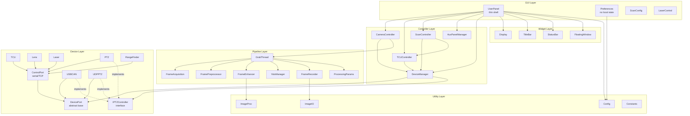

# Phase 6 — Target Architecture Blueprint

> **Project:** GLI_user_panel — current v0.10.2.0 → target v0.11.1.0 (1.0 candidate)
> **Date:** 2026-03-02
> **Cross-references:** All previous phases
> **Principle:** Zero feature loss, zero behavior change, incremental structural improvement.

---

## 1. Architecture Overview

### Current State → Target State

```
CURRENT (monolithic)                    TARGET (layered)
┌──────────────────────┐                ┌──────────────────────────────┐
│     UserPanel         │                │          GUI Layer            │
│  (6994 lines,         │                │  UserPanel (thin shell)       │
│   200+ members,       │                │  Preferences, ScanConfig      │
│   everything here)    │                │  LaserControl, DevOptions     │
├──────────────────────┤                ├──────────────────────────────┤
│     Preferences       │                │       Controller Layer        │
│  (60+ duplicate       │                │  CameraCtrl, TCUCtrl          │
│   state members)      │                │  ScanCtrl, AuxPanelMgr        │
├──────────────────────┤                ├──────────────────────────────┤
│  mywidget.h           │                │       Pipeline Layer          │
│  (13 classes in       │                │  FrameAcquisition             │
│   one file)           │                │  FramePreprocessor            │
├──────────────────────┤                │  FrameEnhancer                │
│  Device ports         │                │  FrameRecorder, YoloManager   │
│  (3 PTZ types,        │                ├──────────────────────────────┤
│   no common iface)    │                │       Service Layer           │
├──────────────────────┤                │  DeviceManager, Config        │
│  ImageProc, ImageIO   │                │  ProcessingParams             │
│  (already clean)      │                ├──────────────────────────────┤
└──────────────────────┘                │       Device Layer            │
                                        │  DevicePort (base)            │
                                        │  ├─ ControlPort → TCU, Lens…  │
                                        │  ├─ USBCAN                    │
                                        │  └─ UDPPTZ                    │
                                        │  IPTZController (interface)   │
                                        ├──────────────────────────────┤
                                        │       Widget Layer            │
                                        │  Display, TitleBar, StatusBar │
                                        │  FloatingWindow, Ruler, etc.  │
                                        ├──────────────────────────────┤
                                        │       Utility Layer           │
                                        │  ImageProc, ImageIO, Config   │
                                        │  Constants, Util              │
                                        └──────────────────────────────┘
```

### Dependency Rules

1. **GUI Layer** → Controller Layer, Widget Layer, Service Layer
2. **Controller Layer** → Service Layer, Pipeline Layer, Device Layer
3. **Pipeline Layer** → Utility Layer (ImageProc, ImageIO)
4. **Service Layer** → Device Layer, Utility Layer
5. **Device Layer** → Utility Layer only
6. **Widget Layer** → Utility Layer only (NO upward dependencies)
7. **Utility Layer** → Nothing (leaf)

**Forbidden dependencies:**
- Widget → GUI (no more TitleBar holding Preferences*)
- Device → GUI (no more void* to UserPanel)
- Pipeline → GUI (no more `ui->` or `pref->` reads from grab thread)
- Any layer → UserPanel directly (communicate via signals or interfaces)

---

## 2. Target Directory Structure

```
src/
├── main.cpp
├── util/
│   ├── constants.h              (NEW — named constants from Sprint 3)
│   ├── config.h / config.cpp    (MODIFIED — single source of truth)
│   ├── util.h / util.cpp        (MODIFIED — globals reduced)
│   ├── threadpool.h / threadpool.cpp
│   └── version.h
├── visual/
│   ├── userpanel.h / userpanel.cpp    (REDUCED — thin coordination shell)
│   ├── preferences.h / preferences.cpp (MODIFIED — reads/writes Config, no local state)
│   ├── scanconfig.h / scanconfig.cpp
│   ├── lasercontrol.h / lasercontrol.cpp
│   ├── developeroptions.h / developeroptions.cpp
│   ├── serialserver.h / serialserver.cpp
│   ├── presetpanel.h / presetpanel.cpp
│   └── aliasing.h / aliasing.cpp
├── controller/                         (NEW directory)
│   ├── cameracontroller.h / cameracontroller.cpp
│   ├── tcucontroller.h / tcucontroller.cpp
│   ├── lenscontroller.h / lenscontroller.cpp
│   ├── lasercontroller.h / lasercontroller.cpp
│   ├── rfcontroller.h / rfcontroller.cpp
│   ├── scancontroller.h / scancontroller.cpp
│   ├── auxpanelmanager.h / auxpanelmanager.cpp
│   └── devicemanager.h / devicemanager.cpp
├── pipeline/                           (NEW directory)
│   ├── processingparams.h              (NEW — thread-safe param snapshot)
│   ├── frameacquisition.h / frameacquisition.cpp
│   ├── framepreprocessor.h / framepreprocessor.cpp
│   ├── frameenhancer.h / frameenhancer.cpp
│   ├── framerecorder.h / framerecorder.cpp
│   └── grabthread.h / grabthread.cpp   (MOVED from userpanel, simplified)
├── widgets/                            (SPLIT from mywidget.h)
│   ├── display.h / display.cpp
│   ├── titlebar.h / titlebar.cpp
│   ├── statusbar.h / statusbar.cpp
│   ├── floatingwindow.h / floatingwindow.cpp
│   ├── ruler.h / ruler.cpp
│   ├── coordinate.h / coordinate.cpp
│   ├── animationlabel.h / animationlabel.cpp
│   └── miscselection.h / miscselection.cpp
├── port/
│   ├── deviceport.h                    (NEW — abstract base)
│   ├── controlport.h / controlport.cpp (MODIFIED — inherits DevicePort)
│   ├── iptzcontroller.h               (NEW — PTZ interface)
│   ├── tcu.h / tcu.cpp
│   ├── lens.h / lens.cpp
│   ├── laser.h / laser.cpp
│   ├── ptz.h / ptz.cpp                (MODIFIED — implements IPTZController)
│   ├── rangefinder.h / rangefinder.cpp
│   ├── usbcan.h / usbcan.cpp          (MODIFIED — inherits DevicePort, implements IPTZController)
│   ├── udpptz.h / udpptz.cpp          (MODIFIED — inherits DevicePort, implements IPTZController)
│   ├── pelco_d.h                       (NEW — protocol constants)
│   ├── tcu_protocol.h                  (NEW — protocol constants)
│   └── huanyu.h / huanyu.cpp
├── image/
│   ├── imageproc.h / imageproc.cpp     (UNCHANGED)
│   └── imageio.h / imageio.cpp         (UNCHANGED)
├── cam/
│   ├── cam.h                           (FIXED — virtual destructor)
│   ├── mvcam.h / mvcam.cpp
│   └── ebuscam.h / ebuscam.cpp        (WIN32 only)
├── yolo/
│   ├── yolo_detector.h / yolo_detector.cpp
│   ├── yolo_manager.h / yolo_manager.cpp  (NEW — lifecycle extracted)
│   ├── inference.h / inference.cpp
│   └── yolo_app_config.h
├── thread/
│   └── joystick.h / joystick.cpp       (MODIFIED — typed pointer)
└── automation/
    ├── scanpreset.h / scanpreset.cpp   (KEPT — clean data class)
    └── (autoscan.h/cpp REMOVED — rebuild after refactor)
```

---

## 3. Key Class Specifications

### 3.1 DevicePort — Abstract Device Base

```
┌─────────────────────────────────────────────────┐
│ DevicePort (abstract)                           │
│ file: port/deviceport.h                         │
├─────────────────────────────────────────────────┤
│ # protected:                                    │
│   QMutex write_mutex, read_mutex, retrieve_mtx  │
│   QByteArray received, last_read                │
│                                                 │
│ + virtual bool is_connected() const = 0         │
│ + virtual void communicate(                     │
│       QByteArray write, uint read_size = 0,     │
│       uint read_timeout = 40,                   │
│       bool heartbeat = false) = 0               │
│                                                 │
│ signals:                                        │
│   connection_status_changed(bool)               │
│   port_io_log(QString)                          │
└─────────────────────────────────────────────────┘
         △                    △                △
         │                    │                │
  ControlPort            USBCAN            UDPPTZ
  (serial/TCP)           (CAN bus)         (UDP socket)
  ├── TCU
  ├── Lens
  ├── Laser
  ├── PTZ ──────┐
  └── RangeFinder│
                 │
         ┌───────┴────────┐
         │ IPTZController │ (interface, separate from DevicePort)
         │ ◇ implemented  │
         │   by PTZ,      │
         │   USBCAN,      │
         │   UDPPTZ       │
         └────────────────┘
```

**Rationale:** DevicePort captures the genuine shared pattern (mutexes, buffers, communicate signature) without forcing serial/TCP on CAN/UDP classes. IPTZController is orthogonal — it captures PTZ-specific operations regardless of transport.

### 3.2 IPTZController — Unified PTZ Interface

```
┌───────────────────────────────────────────────────┐
│ IPTZController (abstract interface)               │
│ file: port/iptzcontroller.h                       │
├───────────────────────────────────────────────────┤
│ + virtual void move(Direction dir, uint speed) = 0│
│ + virtual void stop() = 0                         │
│ + virtual void setAngle(double h, double v) = 0   │
│ + virtual double getAngleH() const = 0            │
│ + virtual double getAngleV() const = 0            │
│ + virtual void setSpeed(uint speed) = 0           │
│                                                   │
│ signals:                                          │
│   angleUpdated(double h, double v)                │
│   connectionChanged(bool connected)               │
├───────────────────────────────────────────────────┤
│ enum Direction {                                  │
│   STOP, UP, DOWN, LEFT, RIGHT,                    │
│   UP_LEFT, UP_RIGHT, DOWN_LEFT, DOWN_RIGHT        │
│ };                                                │
└───────────────────────────────────────────────────┘
```

**Implementation mapping:**

| IPTZController method | PTZ (Pelco-D) | USBCAN (CAN) | UDPPTZ (UDP) |
|----------------------|---------------|---------------|--------------|
| `move(dir, speed)` | `ptz_control(dir)` | `transmit_data(op)` | `transmit_data(op)` |
| `stop()` | `ptz_control(STOP)` | `transmit_data(STOP)` | `transmit_data(STOP)` |
| `setAngle(h, v)` | `ptz_control(SET_H/SET_V)` | `device_control(POSITION/PITCH)` | `device_control(ANGLE_POSITION)` |
| `getAngleH/V()` | `get(ANGLE_H/V)` | `position/pitch` | `horizontal/vertical_angle` |
| `angleUpdated` | `ptz_param_updated` | `angle_updated` | `angle_updated` |

### 3.3 LensController / LaserController / RFController

These three devices are simpler than TCU/PTZ today but are planned to grow:
- **Lens** will participate in algorithms (auto-focus, depth-of-field)
- **Laser** will have multiple hardware versions (current `laser_type` field)
- **RangeFinder** will have multiple hardware versions (current `rf_type` field)

```
┌──────────────────────────────────────────────────────┐
│ LensController                                       │
│ file: controller/lenscontroller.h                    │
├──────────────────────────────────────────────────────┤
│ Owns:                                                │
│   Connection to Lens port (via signals)              │
│   Current positions: zoom, focus, laser_radius       │
│   Focus speed (from slider)                          │
│                                                      │
│ Responsibilities:                                    │
│   Zoom/focus button → Lens command                   │
│   Focus speed slider sync                            │
│   Position query and feedback (update_lens_params)   │
│   Blocking set_pos_temp() orchestration              │
│   Expose lens position data to pipeline              │
│     (for future auto-focus / depth algorithms)       │
│                                                      │
│ Extracted from:                                      │
│   userpanel.cpp: update_lens_params (~30 lines)      │
│   userpanel.cpp: change_focus_speed (~10 lines)      │
│   userpanel.cpp: lens button handlers (~40 lines)    │
│   userpanel.cpp: focus speed slider setup            │
│                                                      │
│ signals:                                             │
│   send_lens_msg(qint32, uint)                        │
│   set_lens_pos(qint32, uint)                         │
│   lens_position_changed(uint zoom, uint focus)       │
│   focus_speed_changed(uint)                          │
└──────────────────────────────────────────────────────┘

┌──────────────────────────────────────────────────────┐
│ LaserController                                      │
│ file: controller/lasercontroller.h                   │
├──────────────────────────────────────────────────────┤
│ Owns:                                                │
│   Connection to Laser port (via signals)             │
│   Laser type (from Config)                           │
│   Laser state (on/off, power level if applicable)    │
│                                                      │
│ Responsibilities:                                    │
│   LaserControl dialog → Laser command                │
│   Type-specific command formatting                   │
│   Laser safety interlocks (if any)                   │
│                                                      │
│ Extracted from:                                      │
│   userpanel.cpp: send_laser_msg emission points      │
│   visual/lasercontrol.cpp: button handlers           │
│                                                      │
│ Note: If future laser versions differ enough to need │
│ separate protocol classes (like PTZ/USBCAN/UDPPTZ),  │
│ introduce ILaserController interface at that time.   │
│ Current laser_type variations are handled internally │
│ by the single Laser class, so an interface now would │
│ be premature.                                        │
│                                                      │
│ signals:                                             │
│   send_laser_msg(QString)                            │
│   laser_state_changed(bool on)                       │
└──────────────────────────────────────────────────────┘

┌──────────────────────────────────────────────────────┐
│ RFController                                         │
│ file: controller/rfcontroller.h                      │
├──────────────────────────────────────────────────────┤
│ Owns:                                                │
│   Connection to RangeFinder port (via signals)       │
│   RF type (from Config)                              │
│   Last measured distance                             │
│                                                      │
│ Responsibilities:                                    │
│   Receive distance_updated from RangeFinder          │
│   Format distance for display (unit conversion)      │
│   Feed distance to TCUController for auto-delay      │
│     (if RF-assisted ranging is enabled)              │
│   Type-specific protocol selection                   │
│                                                      │
│ Extracted from:                                      │
│   userpanel.cpp: update_distance (~15 lines)         │
│   Distance display label updates                     │
│                                                      │
│ Note: Same as Laser — introduce IRangeFinderCtrl     │
│ interface when a second RF class appears. Current    │
│ rf_type is handled inside the single RangeFinder     │
│ class.                                               │
│                                                      │
│ signals:                                             │
│   distance_changed(double meters)                    │
│   rf_connected(bool)                                 │
└──────────────────────────────────────────────────────┘
```

**Interface upgrade path:** Both Laser and RangeFinder already have internal `type` fields. When a future hardware version requires a fundamentally different protocol class (not just parameter variations), the upgrade is:
1. Extract `ILaserController` / `IRangeFinderController` from the concrete controller
2. Create the new protocol class implementing the interface
3. DeviceManager selects implementation based on config — same pattern as IPTZController

### 3.4 ProcessingParams — Thread-Safe Parameter Snapshot

```
┌──────────────────────────────────────────────────────┐
│ ProcessingParams                                     │
│ file: pipeline/processingparams.h                    │
├──────────────────────────────────────────────────────┤
│ Main-window params (frequent):                       │
│   int enhance_option        (ENHANCE_OPTIONS index)  │
│   bool enhance_enabled      (IMG_ENHANCE_CHECK)      │
│   int brightness             (-5 to +5)              │
│   int contrast               (-10 to +10)            │
│   int gamma_slider           (0 to 20)               │
│   bool frame_avg_enabled    (FRAME_AVG_CHECK)        │
│   int frame_avg_mode        (0=simple, 1=ECC)        │
│   bool enable_3d            (IMG_3D_CHECK)            │
│   bool pseudocolor          (PSEUDOCOLOR_CHK)         │
│                                                      │
│ Preferences params (advanced):                       │
│   float accu_base                                    │
│   float pref_gamma, low_in, high_in, low_out, high_out│
│   float dehaze_pct                                    │
│   int colormap                                        │
│   double lower_3d_thresh, upper_3d_thresh            │
│   bool truncate_3d, custom_3d_param                  │
│   float custom_3d_delay, custom_3d_gate_width        │
│   bool auto_mcp                                       │
│   ECC params: warp_mode, fusion_method, backward,    │
│     forward, levels, max_iter, eps,                   │
│     half_res_reg, half_res_fuse, window_mode          │
│                                                      │
│ #ifdef LVTONG                                        │
│   int model_idx                                       │
│   bool fishnet_recog                                  │
│ #endif                                               │
├──────────────────────────────────────────────────────┤
│ + ProcessingParams snapshot()          (mutex-locked) │
│ + void update_main(...)     (called by UI thread)    │
│ + void update_advanced(...) (called by Preferences)  │
├──────────────────────────────────────────────────────┤
│ # private:                                           │
│   mutable QMutex mutex                               │
│   ProcessingParams current  (guarded by mutex)       │
└──────────────────────────────────────────────────────┘
```

**Data flow:**
```
Main Window sliders ──→ update_main() ──→ current (mutex) ──→ snapshot() ──→ grab thread
Preferences dialog  ──→ update_advanced() ─┘
```

The grab thread calls `snapshot()` once per frame to get a consistent copy. No more direct `ui->` or `pref->` reads from the grab thread.

### 3.5 CameraController

```
┌─────────────────────────────────────────────────────────┐
│ CameraController                                        │
│ file: controller/cameracontroller.h                     │
├─────────────────────────────────────────────────────────┤
│ Owns:                                                   │
│   Cam* curr_cam                                         │
│   GrabThread* grab_threads[3]                           │
│   TimedQueue q_fps_calc                                 │
│   Frame queues (frame_q, frame_info_q, frame_time_q)    │
│                                                         │
│ Responsibilities (from UserPanel):                      │
│   Camera enumeration and selection                      │
│   Start/stop grabbing                                   │
│   Trigger mode, exposure, gain, frame rate              │
│   Pixel type, IP configuration                          │
│   GrabThread lifecycle                                  │
│   Frame queue management                                │
│                                                         │
│ Extracted from:                                         │
│   userpanel.cpp: on_ENUM_BTN_clicked (~60 lines)        │
│   userpanel.cpp: on_START_BUTTON_clicked (~85 lines)    │
│   userpanel.cpp: on_SHUTDOWN_BUTTON_clicked (~20 lines) │
│   userpanel.cpp: on_GRABBING_BUTTON_clicked (~25 lines) │
│   userpanel.cpp: camera parameter setters (~100 lines)  │
│                                                         │
│ signals:                                                │
│   camera_connected(bool), frame_ready(int idx),         │
│   camera_error(QString)                                 │
└─────────────────────────────────────────────────────────┘
```

### 3.6 TCUController

```
┌──────────────────────────────────────────────────────────┐
│ TCUController                                            │
│ file: controller/tcucontroller.h                         │
├──────────────────────────────────────────────────────────┤
│ Owns:                                                    │
│   Connection to TCU port (via signals)                   │
│   Physics constants (c, dist_ns)                         │
│   State: delay_dist, depth_of_view, rep_freq,            │
│          laser_width, mcp                                │
│   Offset values (from Config)                            │
│                                                          │
│ Responsibilities (from UserPanel):                       │
│   Slider ↔ TCU synchronization                           │
│   update_tcu_params() — receive TCU feedback             │
│   change_mcp() — MCP control with throttling             │
│   change_delay() / update_delay()                        │
│   change_gatewidth() / update_gate_width()               │
│   update_laser_width()                                   │
│   Distance ↔ delay conversion (EST_DIST, EST_DOV)        │
│   AB lock logic                                          │
│                                                          │
│ Extracted from:                                          │
│   userpanel.cpp: update_tcu_params (~90 lines)           │
│   userpanel.cpp: change_mcp (~20 lines)                  │
│   userpanel.cpp: change_delay (~30 lines)                │
│   userpanel.cpp: change_gatewidth (~30 lines)            │
│   userpanel.cpp: update_laser_width/delay/gate_width     │
│     (~70 lines, includes throttling)                     │
│   userpanel.cpp: on_DIST_BTN_clicked (~40 lines)         │
│   userpanel.cpp: on_DOV_BTN_clicked (~30 lines)          │
│                                                          │
│ signals:                                                 │
│   send_double_tcu_msg(qint32, double)                    │
│   send_uint_tcu_msg(qint32, uint)                        │
│   delay_changed(double dist_m)                           │
│   gatewidth_changed(double dov_m)                        │
│   mcp_changed(int)                                       │
│   prf_changed(double)                                    │
│                                                          │
│ Note: UI widgets (sliders, edits) still live in          │
│   UserPanel's .ui file. TCUController connects to them   │
│   via signals passed during init.                        │
└──────────────────────────────────────────────────────────┘
```

### 3.7 ScanController

```
┌──────────────────────────────────────────────────────────┐
│ ScanController                                           │
│ file: controller/scancontroller.h                        │
├──────────────────────────────────────────────────────────┤
│ Owns:                                                    │
│   Scan state machine (idle → scanning → complete)        │
│   scan_ptz_route, scan_tcu_route                         │
│   scan_ptz_idx, scan_tcu_idx                             │
│   scan_3d, scan_sum accumulator matrices                 │
│   Scan save directory and parameter file                 │
│                                                          │
│ Dependencies:                                            │
│   IPTZController* (for angle commands)                   │
│   TCUController* (for delay/gatewidth advancement)       │
│   ScanConfig* (for scan parameters)                      │
│   ScanPreset (reused data class)                         │
│                                                          │
│ Extracted from:                                          │
│   userpanel.cpp: on_SCAN_BUTTON_clicked (~70 lines)      │
│   userpanel.cpp: on_CONTINUE/RESTART_SCAN (~25 lines)    │
│   userpanel.cpp: scan advancement in grab_thread         │
│     (lines 1729-1788, ~60 lines)                         │
│   userpanel.cpp: enable_scan_options (~15 lines)         │
│                                                          │
│ Critical fix: Scan advancement communicates via signals   │
│   (Qt::QueuedConnection), NOT direct UI slot calls.      │
│                                                          │
│ signals:                                                 │
│   scan_started(), scan_paused(), scan_completed()        │
│   advance_delay(double), advance_ptz(double h, double v) │
│   request_frame_save(QString path, bool ori, bool res)   │
└──────────────────────────────────────────────────────────┘
```

### 3.8 AuxPanelManager

```
┌──────────────────────────────────────────────────────────┐
│ AuxPanelManager                                          │
│ file: controller/auxpanelmanager.h                       │
├──────────────────────────────────────────────────────────┤
│ Owns:                                                    │
│   alt_display_option state                               │
│   MISC_RADIO button group wiring                         │
│   MISC_OPTION combo box configuration                    │
│   QStackedWidget page switching                          │
│                                                          │
│ Content sources (receives via signals):                  │
│   DATA page: port_io_log from DeviceManager              │
│   HIST page: histogram pixmap from pipeline              │
│   PTZ page: angle/status from IPTZController             │
│   ALT page: alternate processing result from pipeline    │
│   ADDON page: addon content (future extension point)     │
│   VID page: video playback (future)                      │
│   YOLO page: detection results from YoloManager          │
│                                                          │
│ Extracted from:                                          │
│   userpanel.cpp: MISC_RADIO/OPTION setup (~20 lines)     │
│   userpanel.cpp: on_MISC_RADIO_*_clicked (~40 lines)     │
│   userpanel.cpp: DATA_EXCHANGE text append connection     │
│                                                          │
│ Note: AuxPanelManager does NOT own the content widgets    │
│   themselves — they remain in the .ui file. It owns the   │
│   switching logic and content routing.                    │
└──────────────────────────────────────────────────────────┘
```

### 3.9 DeviceManager

```
┌──────────────────────────────────────────────────────────┐
│ DeviceManager                                            │
│ file: controller/devicemanager.h                         │
├──────────────────────────────────────────────────────────┤
│ Owns:                                                    │
│   All DevicePort instances + their QThreads:             │
│     TCU*, Lens*, Laser*, PTZ*, RangeFinder*              │
│     USBCAN*, UDPPTZ*                                     │
│   IPTZController* active_ptz (points to one of 3)        │
│   Thread lifecycle (create, moveToThread, start, stop)   │
│   Port connection/disconnection (serial, TCP, CAN, UDP)  │
│   Port status display updates                            │
│   Port sharing (TCU shares port with Lens/Laser)         │
│                                                          │
│ Responsibilities:                                        │
│   COM edit → connect/disconnect logic                    │
│   Port status → StatusBar icon updates                   │
│   PTZ type switching (serial/CAN/UDP)                    │
│   Provide port references to controllers:                │
│     tcu()   → TCUController                              │
│     lens()  → LensController                             │
│     laser() → LaserController                            │
│     rf()    → RFController                               │
│     active_ptz() → ScanController, UserPanel             │
│                                                          │
│ Extracted from:                                          │
│   userpanel.cpp: init_control_port() (~130 lines)        │
│   userpanel.cpp: COM edit returnPressed lambdas          │
│   userpanel.cpp: update_port_status calls                │
│                                                          │
│ Note: DeviceManager owns the port objects and threads.   │
│ Controllers (TCUCtrl, LensCtrl, LaserCtrl, RFCtrl)      │
│ own the device-specific logic. DeviceManager provides    │
│ port references during controller init, not at runtime.  │
│                                                          │
│ signals:                                                 │
│   ptz_type_changed(IPTZController*)                      │
│   port_status_changed(int port_idx, int status)          │
└──────────────────────────────────────────────────────────┘
```

### 3.10 Pipeline Stages

```
┌──────────────────────┐   ┌──────────────────────┐   ┌──────────────────────┐
│  FrameAcquisition    │──▶│  FramePreprocessor   │──▶│  FrameEnhancer       │
│                      │   │                      │   │                      │
│ - Queue management   │   │ - Rotation/flip      │   │ - 10 enhance algos   │
│ - Overflow handling  │   │ - Resize             │   │ - Brightness/contrast│
│ - Frame info sync    │   │ - Histogram calc     │   │ - Gamma correction   │
│ - Desync detection   │   │ - Auto-MCP           │   │ - Frame averaging    │
│                      │   │                      │   │ - ECC temporal denoise│
│ Input: raw queues    │   │ Input: raw frame     │   │ - 3D gated imaging   │
│ Output: cv::Mat +    │   │ Output: preprocessed │   │ - Pseudocolor        │
│   metadata           │   │   frame + histogram  │   │                      │
└──────────────────────┘   └──────────────────────┘   │ Input: preprocessed  │
                                                      │   frame + Params     │
┌──────────────────────┐   ┌──────────────────────┐   │ Output: enhanced     │
│  FrameRecorder       │◀──│  YoloManager         │◀──│   frame              │
│                      │   │                      │   └──────────────────────┘
│ - Image save (BMP,   │   │ - Model lifecycle    │
│   TIF, JPG)          │   │   (load/unload/swap) │
│ - Video recording    │   │ - Inference dispatch  │
│   (vid_out[4])       │   │ - Detection overlay   │
│ - Save path mgmt     │   │                      │
│ - Frame info overlay │   │ Input: frame          │
│                      │   │ Output: frame +       │
│ Input: final frame   │   │   detections          │
│ Output: file on disk │   └──────────────────────┘
└──────────────────────┘

#ifdef LVTONG ─────────────────────────────────────────
│  FishnetDetector (compile-time only)                 │
│  - DNN inference with cv::dnn                        │
│  - Softmax classification                            │
│  - Shares YoloManager's lifecycle slot in pipeline   │
└──────────────────────────────────────────────────────┘
```

**Pipeline wiring in GrabThread (target ~50 lines):**
```cpp
void GrabThread::run() {
    ProcessingParams params;
    while (m_running) {
        params = m_params_source->snapshot();  // thread-safe copy

        auto frame = m_acquisition.acquire(m_queues, m_display_idx);
        if (frame.empty()) continue;

        auto preprocessed = m_preprocessor.process(frame, params);

        if (params.yolo_enabled)
            m_yolo_manager.detect(preprocessed.frame);

#ifdef LVTONG
        if (params.fishnet_recog)
            m_fishnet.detect(preprocessed.frame);
#endif

        auto enhanced = m_enhancer.process(preprocessed, params);

        emit display_ready(enhanced.frame, m_display_idx);

        if (m_scan_active)
            emit scan_frame_ready(enhanced);

        m_recorder.process(enhanced, params);
    }
}
```

---

## 4. Reduced UserPanel — Target State

After all extractions, UserPanel becomes a **thin coordination shell**:

```
┌──────────────────────────────────────────────────────────┐
│ UserPanel (target: < 1500 lines)                         │
├──────────────────────────────────────────────────────────┤
│ Owns (created in constructor/init):                      │
│   Ui::UserPanel *ui                                      │
│   CameraController *camera_ctrl                          │
│   TCUController *tcu_ctrl                                │
│   LensController *lens_ctrl                              │
│   LaserController *laser_ctrl                            │
│   RFController *rf_ctrl                                  │
│   ScanController *scan_ctrl                              │
│   DeviceManager *device_mgr                              │
│   AuxPanelManager *aux_panel                             │
│   Config *config                                         │
│   ProcessingParams *proc_params                          │
│   Preferences *pref        (dialog, no state duplication)│
│   ScanConfig *scan_config  (dialog)                      │
│                                                          │
│ Responsibilities:                                        │
│   1. Create and wire all controllers (init)              │
│   2. Forward UI events to appropriate controller         │
│   3. keyPressEvent dispatching                           │
│   4. Window management (resize, close, theme switch)     │
│   5. Drag-and-drop file handling                         │
│   6. Config load/save orchestration                      │
│   7. Display rendering (set_pixmap signals)              │
│                                                          │
│ Removed from UserPanel:                                  │
│   ✗ Camera lifecycle → CameraController                  │
│   ✗ TCU slider sync → TCUController                      │
│   ✗ Lens control → LensController                        │
│   ✗ Laser control → LaserController                      │
│   ✗ Distance display → RFController                      │
│   ✗ Scan state machine → ScanController                  │
│   ✗ Device port creation/wiring → DeviceManager          │
│   ✗ Alt display switching → AuxPanelManager              │
│   ✗ Image processing dispatch → FrameEnhancer            │
│   ✗ Frame queue management → FrameAcquisition            │
│   ✗ Video recording → FrameRecorder                      │
│   ✗ YOLO model lifecycle → YoloManager                   │
│   ✗ Direct pref->member reads → ProcessingParams         │
└──────────────────────────────────────────────────────────┘
```

### init() — Target Wiring (~200 lines, down from ~400)

```
UserPanel::init() {
    // 1. Create services
    config = new Config(this);
    proc_params = new ProcessingParams();

    // 2. Create controllers
    device_mgr = new DeviceManager(config, this);
    camera_ctrl = new CameraController(device_mgr, this);
    tcu_ctrl = new TCUController(device_mgr->tcu(), config, this);
    lens_ctrl = new LensController(device_mgr->lens(), config, this);
    laser_ctrl = new LaserController(device_mgr->laser(), config, this);
    rf_ctrl = new RFController(device_mgr->rf(), config, this);
    scan_ctrl = new ScanController(device_mgr, tcu_ctrl, this);
    aux_panel = new AuxPanelManager(this);

    // 3. Wire controllers to UI widgets
    tcu_ctrl->bind_sliders(ui->DELAY_SLIDER, ui->GW_SLIDER, ui->MCP_SLIDER);
    tcu_ctrl->bind_edits(ui->DELAY_EDIT, ui->GW_EDIT, ...);
    lens_ctrl->bind_ui(ui->FOCUS_SPEED_SLIDER, ui->FOCUS_SPEED_EDIT, ...);
    camera_ctrl->bind_ui(ui->ENUM_BTN, ui->START_BUTTON, ...);
    scan_ctrl->bind_ui(ui->SCAN_BUTTON, scan_config);
    aux_panel->bind_ui(ui->MISC_RADIO_1, ..., ui->MISC_OPTION_1, ...);

    // 4. Wire cross-controller connections
    connect(rf_ctrl, &RFController::distance_changed,
            tcu_ctrl, &TCUController::on_distance_received);  // RF-assisted ranging

    // 5. Wire display outputs
    connect(camera_ctrl, &CameraController::display_ready,
            this, &UserPanel::update_display, Qt::QueuedConnection);

    // 6. Load config
    config->load_from_file(...);
    syncConfigToUI();
}
```

---

## 5. Config as Single Source of Truth

### Current Data Flow (broken)
```
Config ←──save──→ JSON file
  │
  ├──syncConfigToPreferences()──→ Preferences (60+ members: copies)
  │                                     ↕
  │                              UserPanel reads pref->
  │
  └──syncPreferencesToConfig()──← UserPanel state
```

### Target Data Flow
```
Config ←──save/load──→ JSON file
  │
  ├──read────→ Preferences (NO local state, reads Config directly)
  │                │
  │                └──write──→ Config
  │
  ├──read────→ TCUController (reads config.tcu.*)
  │
  ├──read────→ DeviceManager (reads config.com_*, config.device.*)
  │
  ├──read────→ ProcessingParams (reads config for advanced params)
  │
  └──signal──→ config_changed(section) ──→ observers refresh
```

**Config additions:**
```cpp
// New signal
void Config::config_changed(const QString& section);

// Called after any write
void Config::notify(const QString& section) {
    emit config_changed(section);
    if (auto_save_enabled) auto_save();
}
```

Preferences becomes a pure view: `pref->ui->MAX_DIST_EDIT->text()` reads from Config on dialog open, writes to Config on dialog accept. No `pref->max_dist` member variable.

---

## 6. Mermaid Architecture Diagram



---

## 7. Migration Strategy

### Phase A: Foundation (Sprints 0–4)
**No architectural change.** Fix bugs, remove dead code, add constants, eliminate duplication. The codebase becomes cleaner but structurally identical.

**Checkpoint:** All existing behavior preserved. `diff` shows only deletions and constant extractions.

### Phase B: Safety Layer (Sprint 5)
Fix thread-safety violations. This is prerequisite infrastructure — without it, extraction could introduce new data races.

**Checkpoint:** No more direct `ui->` / `pref->` reads from grab thread. All cross-thread access via signals or ProcessingParams.

### Phase C: Leaf Extractions (Sprints 2, 6)
Extract widgets (mywidget split) and create IPTZController interface. These are "leaf" changes — they don't affect UserPanel's structure, just its dependencies.

**Checkpoint:** Three PTZ types behind one interface. Widget files split. Build still works identically.

### Phase D: Vertical Slicing (Sprints 7, 8)
Config becomes single source of truth. Pipeline extracted from grab_thread_process. These are the first real structural changes.

**Order matters:**
1. ProcessingParams first — needed by pipeline
2. Config refactor — removes Preferences state duplication
3. Pipeline extraction — each stage is one commit

**Checkpoint:** grab_thread_process reduced to ~50 lines. Config is authoritative. Preferences has no local state.

### Phase E: Controller Extraction (Sprint 9)
Extract CameraController, TCUController, ScanController, AuxPanelManager, DeviceManager from UserPanel. Each extraction is one PR.

**Order:**
1. DeviceManager first (owns device creation — other controllers depend on it)
2. TCUController (most complex, highest value)
3. CameraController (owns grab threads, depends on DeviceManager)
4. ScanController (depends on TCUController + IPTZController)
5. AuxPanelManager (last — depends on pipeline outputs)

**Checkpoint:** UserPanel < 1500 lines. Each controller independently testable.

### Phase F: Post-Refactor (Future)
After the structure is clean:
1. Rebuild AutoScan against new interfaces (ScanController, DeviceManager, Config)
2. Extract ShortcutHandler (controllers register their own shortcuts)
3. LensController extraction (if lens features grow)
4. User-configurable keymaps
5. Plugin system for detection models (if LVTONG runtime becomes acceptable)

---

## 8. Interface Contracts Between Layers

### GUI ↔ Controller
- Controllers expose **signals** for state changes
- Controllers expose **public slots** for UI actions
- Controllers do NOT hold widget pointers — they receive widget references during `bind_*()` calls
- UI layout remains in `.ui` files — controllers wire to widgets, not own them

### Controller ↔ Pipeline
- Pipeline stages are **plain C++ classes** (not QObjects), except GrabThread
- Controllers pass ProcessingParams by value (snapshot)
- Pipeline outputs emit via GrabThread signals (Qt::QueuedConnection)

### Controller ↔ Device
- All device communication via **queued signal-slot connections** (cross-thread safe)
- DeviceManager owns the QThread lifecycle
- Controllers never call device methods directly — always via signals

### Pipeline ↔ Utility
- Direct function calls (ImageProc::static_method, ImageIO::static_method)
- No signals needed — utility functions are pure and thread-safe

---

## 9. File Size Targets

| Component | Current | Target | Reduction |
|-----------|---------|--------|-----------|
| userpanel.cpp | 6994 | < 1500 | −78% |
| userpanel.h | 710 | < 200 | −72% |
| grab_thread_process | ~900 | ~50 | −94% |
| mywidget.h | 305 | 0 (split) | −100% |
| mywidget.cpp | 749 | 0 (split) | −100% |
| preferences.h | ~170 members | ~10 members | −94% |
| **Total new files** | — | ~20 | — |
| **Total new lines** | — | ~3000 | — |
| **Net LOC change** | — | ≈ 0 | Redistribution |

The total line count stays roughly the same — this is a redistribution, not a rewrite. Code moves from monoliths to focused modules.

---

## 10. Verification Checklist

After complete migration, verify:

- [ ] All 181 features from Phase 1 inventory still work
- [ ] All characterization tests from Phase 4 pass
- [ ] No `pref->` reads from any thread other than GUI thread
- [ ] No `ui->` reads from any thread other than GUI thread
- [ ] No `void*` casts remain
- [ ] UserPanel.cpp < 1500 lines
- [ ] grab_thread_process < 100 lines
- [ ] mywidget.h no longer exists (split into individual files)
- [ ] Preferences has < 10 member variables (no state duplication)
- [ ] All three PTZ types work through IPTZController
- [ ] Config round-trip preserves all settings
- [ ] Build succeeds on both MSVC and GCC
- [ ] AutoScan code removed (files still in git history)
- [ ] No new compiler warnings introduced

---

**Phase 6 Complete — All 6 phases delivered.**

### Deliverables Summary

| Phase | Document | Status |
|-------|----------|--------|
| 1 | [phase1-feature-inventory.md](phase1-feature-inventory.md) | Complete |
| 2 | [phase2-architecture-diagnosis.md](phase2-architecture-diagnosis.md) | Complete |
| 3 | [phase3-dependency-map.md](phase3-dependency-map.md) | Complete |
| 4 | [phase4-test-safety-net.md](phase4-test-safety-net.md) | Complete |
| 5 | [phase5-refactoring-roadmap.md](phase5-refactoring-roadmap.md) | Complete |
| 6 | [phase6-target-architecture.md](phase6-target-architecture.md) | Complete |
