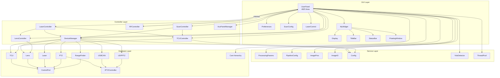

# Phase 2 — Current Architecture Assessment

> Post-Sprint 9 + Thread Safety Fixes | Reviewed 2026-03-16

---

## Table of Contents

1. [Module Map](#1-module-map)
2. [Layering Analysis](#2-layering-analysis)
3. [God Class Residual](#3-god-class-residual-userpanel)
4. [Coupling Metrics](#4-coupling-metrics)
5. [Naming and Convention Audit](#5-naming-and-convention-audit)

---

## 1. Module Map

### Directory Structure

```
src/
├── visual/          UserPanel, Preferences, ScanConfig, LaserControl, Aliasing, PresetPanel, SerialServer, Distance3DView
├── controller/      DeviceManager, TCUController, LensController, LaserController, RFController, ScanController, AuxPanelManager
├── pipeline/        ProcessingParams, PipelineConfig
├── port/            ControlPort, TCU, Lens, Laser, PTZ, RangeFinder, USBCAN, UDPPTZ, IPTZController
├── cam/             Cam (abstract), MvCam, EBusCam, EuresysCam, HQVCam
├── widgets/         MyWidget, Display, TitleBar, StatusBar, FloatingWindow
├── image/           ImageProc, ImageIO
├── util/            Config, constants, util, ThreadPool, version
├── thread/          JoystickThread, ControlPortThread (legacy)
├── yolo/            YoloDetector, Inference, YoloAppConfig
├── automation/      AutoScan, ScanPreset
└── plugins/         PluginInterface
```

### Dependency Diagram (Mermaid)



---

## 2. Layering Analysis

### Intended Layers

```
┌─────────────────────────────────────────────────────┐
│  GUI Layer        widgets, UserPanel UI, Preferences │
├─────────────────────────────────────────────────────┤
│  Controller Layer  7 extracted controllers           │
├─────────────────────────────────────────────────────┤
│  Service Layer     Pipeline, ImageProc, Config, YOLO │
├─────────────────────────────────────────────────────┤
│  Hardware Layer    ControlPort, Cam, protocols       │
└─────────────────────────────────────────────────────┘
```

### Layering Violations

| # | Violation | Severity | Location |
|---|-----------|----------|----------|
| L1 | **DeviceManager holds `Ui::UserPanel*`** and directly manipulates ~20 widgets (COM labels, edits, icons, buttons) | HIGH | devicemanager.h/cpp init() |
| L2 | **TCUController holds `Ui::UserPanel*`** and does widget resizing/layout changes in `set_tcu_type()` | HIGH | tcucontroller.cpp:113-138 |
| L3 | **LensController holds `Ui::UserPanel*`** and sets button text in pressed/released handlers | MEDIUM | lenscontroller.cpp:30-62 |
| L4 | **LaserController accesses `m_pref->ui->LASER_ENABLE_CHK->click()`** — cross-window widget manipulation from controller | HIGH | lasercontroller.cpp:49,90,98 |
| L5 | **UserPanel directly includes cam headers** (`mvcam.h`, `ebuscam.h`, `euresyscam.h`) — GUI layer depends on hardware SDK layer | MEDIUM | userpanel.h |
| L6 | **Pipeline methods in UserPanel** call `window()->grab()` from worker thread | HIGH | userpanel.cpp:1379 |
| L7 | **AuxPanelManager creates QButtonGroup** — widget creation in controller | LOW | auxpanelmanager.cpp:22-43 |

### Clean Boundaries (no violations)

- **Port layer → nothing above**: Zero widget/controller/config includes. Pure data carriers with signal-based communication.
- **Cam layer → nothing above**: Pure SDK abstraction. Only depends on OpenCV and Qt core.
- **Pipeline structs (ProcessingParams, PipelineConfig)**: No project dependencies. Plain data structs.
- **ImageProc**: Pure algorithms, no dependencies on UI or config.
- **IPTZController interface**: Clean abstract interface, no upward dependencies.

### Assessment

The port and cam layers are architecturally clean. The primary violation pattern is **controllers holding `Ui::UserPanel*`** — 5 of 7 controllers directly manipulate widgets. This is a result of Sprint 9's extraction strategy: code was moved from UserPanel to controllers *as-is*, preserving `m_ui->` access patterns rather than introducing a signal/slot boundary. This was a pragmatic trade-off (lower risk, faster extraction) but creates a coupling debt.

---

## 3. God Class Residual: UserPanel

### userpanel.cpp — 4,825 lines

| Category | Lines | % | Key Methods |
|----------|------:|--:|-------------|
| **Pipeline methods** | 689 | 14.3% | acquire_frame, preprocess_frame, detect_yolo, frame_average_and_3d, detect_fishnet, enhance_frame, render_and_display, advance_scan, record_frame, save_to_file, save_scan_img |
| **Constructor** | 458 | 9.5% | UserPanel::UserPanel — signal/slot connections, widget init |
| **keyPressEvent** | 332 | 6.9% | Full keyboard handler — PTZ, TCU, lens, laser, camera, display |
| **Config sync** | 231 | 4.8% | data_exchange, update_processing_params, syncPreferencesToConfig, syncConfigToPreferences |
| **grab_thread_process** | 99 | 2.1% | Main pipeline orchestrator loop |
| **Helper classes** | 55 | 1.1% | TimedQueue, GrabThread nested class |
| **Camera lifecycle** | 48 | 1.0% | GrabThread ctor/dtor, ~UserPanel |
| **UI slots & event handlers** | ~1,400 | 29.0% | ~80+ on_*_clicked slots, mouse/joystick handlers |
| **Remaining glue** | ~1,513 | 31.3% | init(), shut_down(), enable_controls(), load_image_file, load_video_file, communicate_display, convert_write/read, resizeEvent, drag-drop, etc. |

### userpanel.h — 659 lines

| Metric | Count |
|--------|------:|
| Member variables | ~100 |
| Method declarations | ~173 |
| Signal declarations | ~15 |
| Nested structs (FrameAverageState, ECCState) | 2 |
| Enum (PREF_TYPE) | 1 |

### What Can Still Be Extracted

| Candidate | Estimated Lines | Feasibility | Notes |
|-----------|----------------:|-------------|-------|
| Pipeline → PipelineProcessor class | 689 + 99 = 788 | MEDIUM | Requires decoupling from UserPanel members (img_mem, display, mutexes) |
| keyPressEvent → KeyHandler class | 332 | LOW-MEDIUM | Dispatches to 6+ controllers; needs accessor facade |
| File I/O → FileManager class | ~200 | MEDIUM | save_to_file, load_image_file, load_video_file, convert_write/read |
| Constructor signal connections | ~200 | LOW | Mostly boilerplate wiring; moving doesn't reduce complexity |

### Assessment

UserPanel dropped from ~6500 to 4825 lines (26% reduction). The pipeline methods (14.3%) are the strongest extraction candidate — they're already self-contained methods that take snapshot params. The ~1400 lines of UI slots are mostly thin delegations (1-5 lines each) that are appropriate to stay in the view class.

---

## 4. Coupling Metrics

### Controller Coupling Table

| Controller | Fan-Out | Fan-In | Config? | Ui::UserPanel? | Cross-Controller? |
|-----------|---------|--------|---------|----------------|-------------------|
| **DeviceManager** | 9 (7 ports + Config + Ui) | 5 (UP + 4 controllers) | Direct | YES — heavy | — |
| **TCUController** | 4 (TCU + Config + Ui + Pref) | 3 (UP + LaserC + ScanC) | Direct | YES — heavy | — |
| **LensController** | 2 (Lens via DM + Ui) | 2 (UP + LaserC) | None | YES — medium | — |
| **LaserController** | 4 (DM + LensC + TCUC + Ui/Pref) | 1 (UP) | None | YES — heavy + cross-window | LensC, TCUC |
| **RFController** | 1 (Ui — minimal) | 1 (DM signal) | None | YES — minimal | — |
| **ScanController** | 3 (TCUC + DM + Ui) | 1 (UP) | None | YES — minimal | TCUC, DM |
| **AuxPanelManager** | 1 (Ui) | 1 (UP) | None | YES — expected | — |

### Key Observations

1. **DeviceManager is the coupling hub** — highest fan-out (9) and fan-in (5). It owns all port/thread lifecycle AND does widget manipulation. This is a dual-responsibility problem.

2. **LaserController has the most cross-controller coupling** — depends on DeviceManager, LensController, AND TCUController. Also reaches across to Preferences UI. This is the most tangled controller.

3. **Config access pattern is unsafe** — `Config::get_data()` returns a mutable `ConfigData&` reference. Both DeviceManager and TCUController read Config fields. The worker thread previously read Config directly (now fixed by PipelineConfig snapshot), but GUI-thread reads during concurrent `auto_save()` writes are theoretically unsafe (no mutex on ConfigData). In practice, all Config reads/writes happen on the GUI thread, so this is safe *by convention* but not *by contract*.

4. **RFController and ScanController are well-isolated** — minimal coupling, clear responsibilities, good models for future controller design.

### Module Coupling (Non-Controller)

| Module | Depends On | Depended On By |
|--------|-----------|----------------|
| **Config** | version.h, nlohmann/json | UserPanel, DeviceManager, TCUController, Preferences |
| **ImageProc** | OpenCV only | UserPanel (pipeline methods) |
| **YoloDetector** | OpenCV, ONNX runtime | UserPanel (detect_yolo) |
| **ControlPort** | util.h, QSerialPort/QTcpSocket | All 7 port classes |
| **Cam (abstract)** | OpenCV, Qt core | MvCam, EBusCam, EuresysCam, HQVCam; UserPanel |

---

## 5. Naming and Convention Audit

### Method Naming

| Layer | Convention | Examples | Consistency |
|-------|-----------|----------|-------------|
| Port classes | snake_case | `get_baudrate()`, `set_type()`, `get_port_status()` | CONSISTENT |
| Controllers | snake_case (Qt slot style) | `on_SCAN_BUTTON_clicked()`, `set_delay_dist()`, `update_ptz_angle()` | CONSISTENT |
| UserPanel | snake_case (Qt slot style) | `grab_thread_process()`, `update_processing_params()` | CONSISTENT |
| Cam classes | mixed | `search_for_devices()`, `start_grabbing()`, `pixel_type()` | MOSTLY CONSISTENT |
| Config | snake_case | `load_from_file()`, `auto_save()`, `get_data()` | CONSISTENT |
| ImageProc | snake_case | Static functions: `dehaze()`, `enhance_detail()`, `fast_guided_filter()` | CONSISTENT |

**Verdict**: Method naming is consistently snake_case across the project. Qt's auto-generated `on_WIDGET_signal()` pattern is used for UI slots. No issues.

### Member Variable Naming

| Layer | Convention | Examples |
|-------|-----------|----------|
| Controllers | `m_` prefix for injected deps; bare names for state | `m_config`, `m_ui`, `m_device_mgr`; `scan`, `delay_dist`, `angle_h` |
| UserPanel | `m_` for new additions; bare names for legacy | `m_params_mutex`, `m_processing_params`, `m_pipeline_config`; `img_mem`, `device_type`, `frame_rate_edit` |
| Port classes | bare names | `serial_port`, `tcp_port`, `received` |

**Issue**: Mixed convention — Sprint 7-9 additions use `m_` prefix, legacy code uses bare names. Not urgent but inconsistent.

### File Naming

All source files use lowercase with no separators: `devicemanager.h`, `tcucontroller.h`, `controlport.h`, `processingparams.h`.

**Verdict**: CONSISTENT.

### Include Guard Style

All files use `#ifndef CLASSNAME_H` / `#define CLASSNAME_H`. No `#pragma once`.

**Verdict**: CONSISTENT.

### Include Organization

Most files follow: Qt includes → OpenCV/third-party → project includes. No strict ordering enforced, but no egregious violations.

---

## Summary of Key Findings

### Architecture Strengths

1. **Port and cam layers are clean** — proper abstraction, no upward dependencies, signal-based communication
2. **Pipeline snapshot pattern works** — ProcessingParams + PipelineConfig eliminate cross-thread data races for config/UI state
3. **IPTZController interface** is a good abstraction — eliminates type-switches, supports 3 implementations
4. **Config as single source of truth** — structured settings with JSON persistence, well-organized sub-structs

### Architecture Debts

1. **Controllers are view-coupled** — 5/7 controllers hold `Ui::UserPanel*` and directly manipulate widgets. This blocks unit testing and violates MVC separation.
2. **UserPanel remains a god class** — 4825 lines, 100 member variables, 173 methods. Pipeline methods (788 lines) are the ripest extraction target.
3. **Config::get_data() returns mutable reference** — safe by convention (GUI-thread only) but not by contract. No mutex protection.
4. **LaserController cross-window access** — `m_pref->ui->LASER_ENABLE_CHK->click()` is a layering smell and fragile coupling.
5. **`window()->grab()` from worker thread** — pre-existing bug in advance_scan(), needs signal-based fix.
